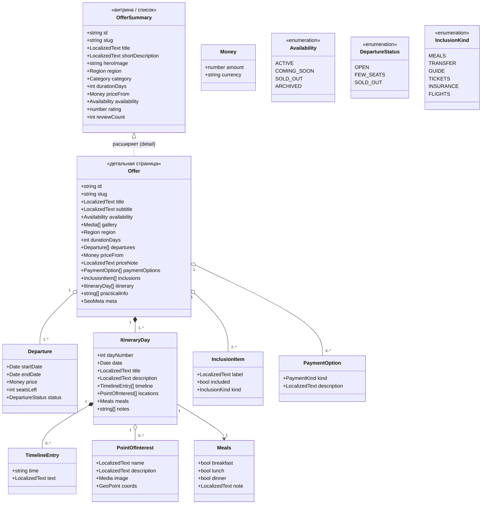
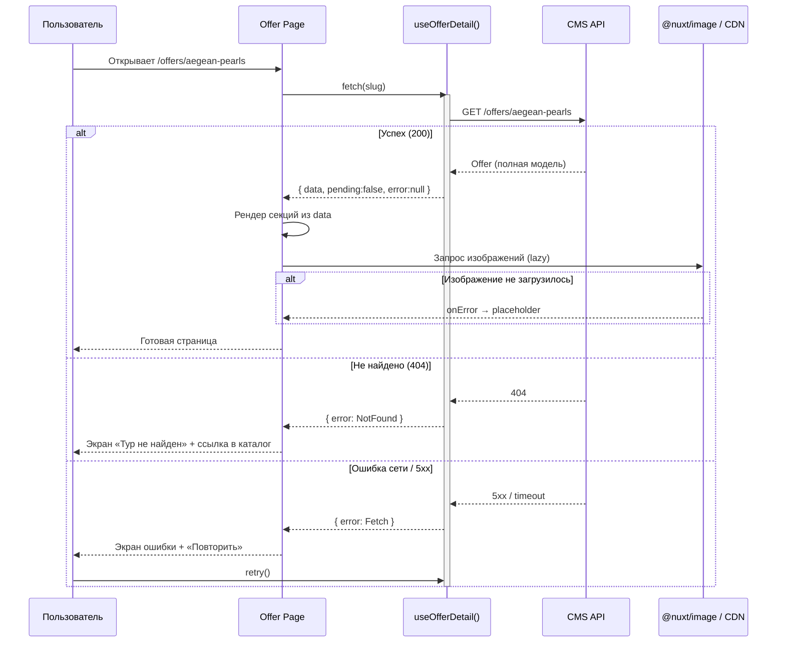

# Архитектура страницы тура (Offer) — 3 версии

> Deliverable для выбора и передачи в UX/UI.
> Только архитектурные UML-диаграммы + краткое описание к каждой версии.
> Диаграммы — в формате **Mermaid** (рендерятся на GitHub и в большинстве редакторов markdown).

## Как этим пользоваться

1. Прочитайте этот файл — здесь **общая для всех версий** доменная модель данных,
   каталог edge-кейсов и поток данных из CMS.
2. Откройте три версии и сравните их подход к **структуре страницы**:
   - [Версия A — Секционная](./version-a-sectioned.md) — простая, линейная, быстрый старт.
   - [Версия B — Блочная / CMS-native](./version-b-blocks.md) — максимально гибкая, редактор-конструктор.
   - [Версия C — Вкладки / прогрессивное раскрытие](./version-c-tabbed.md) — лучший UX для длинного контента.
3. Выберите **одну** и отправьте её файл в UX/UI. Доменная модель и обработка ошибок
   из этого README применимы к любой из трёх.

---

## Контекст: что показал реальный тур

Первый реальный тур («Жемчужины Эгейского побережья», 7 дней) показал, что настоящий
тур — это **не плоская карточка**, а богатая вложенная структура:

| Данные из документа | Чего нет в текущей модели `TouristicOffer` |
|---|---|
| Фиксированные **даты заезда** (19–25.09.2026) | есть только `duration: "7 days"` |
| **Программа по дням** (7 дней, у каждого — тема, тайминг, локации) | нет вообще |
| Тайминг внутри дня (7:00, 9:00, 18:00…) | нет |
| Список **локаций** в дне (Эфес, Шириндже, Памуккале…) | нет |
| **Питание**: 6 завтраков / 1 ужин / 3 обеда | нет |
| Блоки **«что входит / не входит»** | нет |
| **Цена + способ оплаты** (рассрочка, курс к рублю) | только `price: number` |
| Практические заметки («взять купальные принадлежности») | нет |

Вывод: текущий `TouristicOffer` (плоский объект в `useOffers.ts`) — это витринная
**карточка-превью**, а не модель детальной страницы. Все три версии ниже строятся
на новой, расширенной доменной модели, разделяя **лёгкое превью** (для списка) и
**полную модель тура** (для детальной страницы, подгружается отдельно из CMS).

---

## Общая доменная модель (одна для всех трёх версий)

**Ключевые решения модели**

- `OfferSummary` (лёгкий) — для сетки в `/dashboard` и на главной. `Offer` (полный) —
  для `/offers/[id]`, грузится отдельным запросом. Так список остаётся быстрым.
- `LocalizedText` — обёртка `{ ru, en }`. Вся i18n-логика тура живёт в CMS, а не в
  `i18n/locales/*.json` (те остаются для UI-строк интерфейса).
- `departures[]` вместо одной цены — тур продаётся на конкретные даты; цена и места
  привязаны к заезду.
- `itinerary[]` — сердце детальной страницы, то, чего сейчас нет.

---

## Каталог edge-кейсов и обработка ошибок (общий для всех версий)

Эти состояния должны быть предусмотрены дизайном в **любой** версии:

| Кейс | Причина | Поведение UI |
|---|---|---|
| **Загрузка** | ждём ответ CMS | skeleton-заглушки секций (не спиннер на весь экран) |
| **404 / не найдено** | неверный `slug`, тур удалён | страница «тур не найден» + ссылка в каталог |
| **Ошибка загрузки** | CMS недоступна, сеть | экран ошибки + кнопка «Повторить» (retry) |
| **Тур неактивен** (`COMING_SOON`) | ещё не в продаже | контент виден, кнопка брони отключена + подпись «Скоро» |
| **Мест нет** (`SOLD_OUT`) | заезды распроданы | бронь → «Оставить заявку в лист ожидания» |
| **Нет программы по дням** | контент не заполнен в CMS | секция «Программа» скрыта, а не пустая |
| **Нет галереи / одно фото** | мало ассетов | грид схлопывается, hero остаётся |
| **Нет заездов с датами** | даты не назначены | цена «от», кнопка «Уточнить даты» |
| **Локаль без перевода** | заполнен только `ru` | fallback на `ru` + отметка для контент-менеджера |
| **Битое изображение** | ссылка на ассет умерла | placeholder-картинка (`@nuxt/image` fallback) |
| **Частичные данные** | заполнена часть полей | секции рендерятся только при наличии данных (graceful degradation) |

**Принцип:** каждая секция — **самодостаточна** и знает, как выглядеть при
отсутствии своих данных. Ни одна секция не роняет всю страницу.

### Поток данных и обработка ошибок (sequence)

---

## Сравнение трёх версий

| Критерий | A — Секционная | B — Блочная (CMS-native) | C — Вкладки |
|---|---|---|---|
| Структура страницы | фикс. порядок секций | динамический список блоков | секции + навигация/табы |
| Гибкость под CMS | средняя | **максимальная** | средняя |
| Сложность реализации | **низкая** | высокая | средняя |
| UX для длинного контента | средний (длинный скролл) | средний | **лучший** |
| Редактор меняет порядок сам | нет (нужен разработчик) | **да** | нет |
| Deep-link на раздел | нет | частично | **да** (`#itinerary`) |
| Риск «пустого блока» | низкий | средний (нужен контроль) | низкий |
| Скорость вывода MVP | **быстро** | медленно | средне |

### Рекомендация

- **Старт (сейчас, 1 реальный тур):** Версия **A** — быстрее всего довести до продакшена,
  а модель данных уже спроектирована на вырост.
- **Цель (когда подключим CMS и туров станет много):** эволюция в сторону Версии **B**
  или **C**. Секции из A физически переиспользуются как блоки B / панели C — переход
  не требует переписывания, только смены оркестратора.

> **A → B/C — это не три несовместимых пути, а лестница.** Компоненты-секции одни и те же;
> различается только слой, который решает, *что и в каком порядке* показать.
