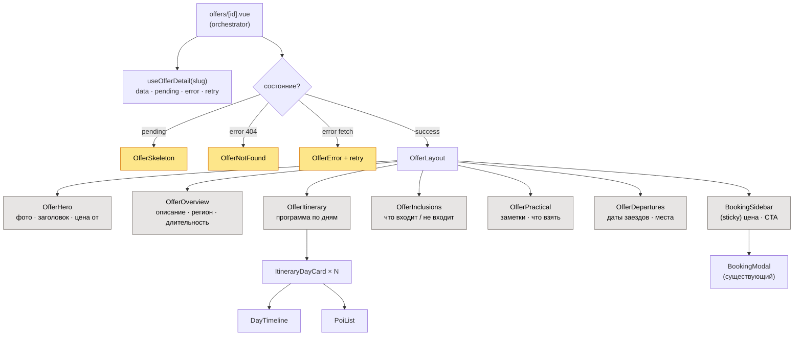
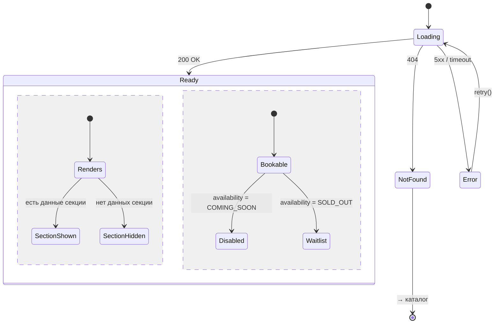

# Версия A — Секционная страница тура

> Простая, линейная, самый быстрый путь в продакшн.
> Домен-модель и обработка ошибок — см. [README](./README.md).

## Идея

Детальная страница тура — это **фиксированная последовательность секций** в заранее
заданном порядке. Каждая секция — отдельный самодостаточный компонент, который получает
свой срез данных и умеет скрываться, если данных нет. Порядок секций задан в коде.

Это ровно та модель, что уже есть в `app/pages/offers/[id].vue`, но разбитая на
переиспользуемые секции и посаженная на новую доменную модель.

## Архитектура компонентов



**Структура файлов**

```
app/
  pages/offers/[id].vue          # оркестратор: fetch + выбор состояния
  components/offer/
    OfferLayout.vue              # раскладка секций (порядок задан здесь)
    OfferHero.vue
    OfferOverview.vue
    OfferItinerary.vue
    ItineraryDayCard.vue
    DayTimeline.vue
    PoiList.vue
    OfferInclusions.vue
    OfferPractical.vue
    OfferDepartures.vue
    BookingSidebar.vue
    states/ OfferSkeleton.vue · OfferNotFound.vue · OfferError.vue
  composables/useOfferDetail.ts  # загрузка полной модели тура
```

## Состояния и edge-кейсы



Каждая секция реализует правило «нет данных → не рендерюсь» (`v-if="hasData"`),
поэтому частично заполненный тур выглядит цельно.

## Плюсы и минусы

**Плюсы**
- Самая быстрая реализация — почти готова, нужно разбить текущую страницу на секции.
- Предсказуемый, «дизайнерски вылизанный» макет: порядок и вид секций под контролем.
- Минимум рисков «пустоты»: секции сами прячутся.

**Минусы**
- Порядок и набор секций меняет только разработчик (не контент-менеджер).
- Для нестандартного тура (например, без дней, но с большой галереей) нужен код.

## Готовность к CMS

CMS отдаёт **плоскую полную модель** `Offer`, страница сама раскладывает поля по
фиксированным секциям. CMS-редактор заполняет поля, но **не управляет версткой**.
Секционные компоненты далее переиспользуются в Версии B (как блоки) и C (как панели) —
поэтому A является безопасным первым шагом.
