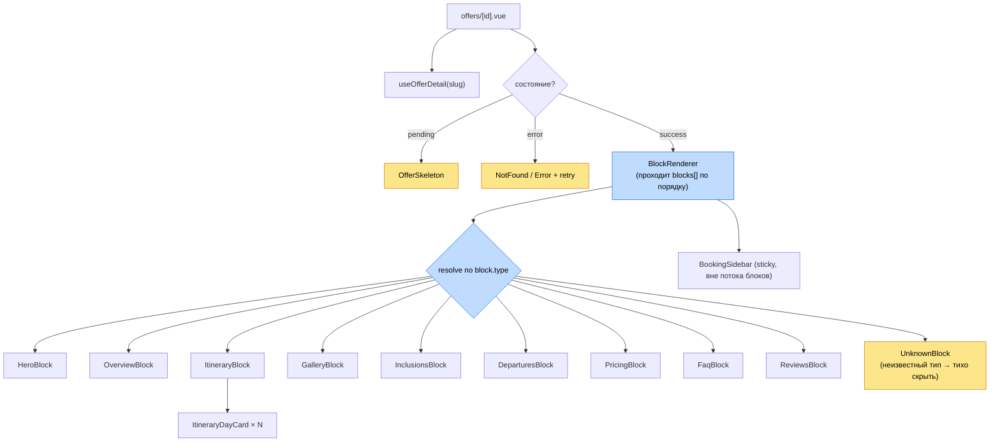
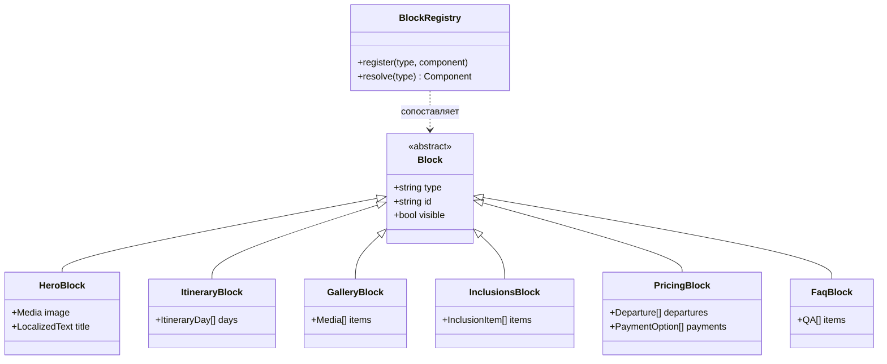
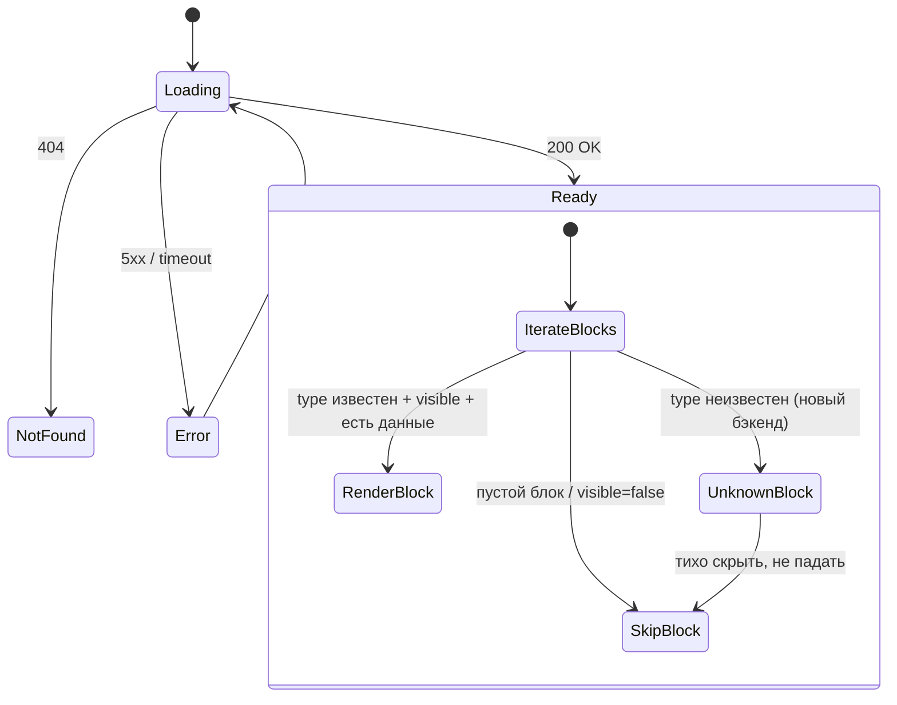

# Версия B — Блочная страница (CMS-native, конструктор)

> Максимально гибкая. Редактор собирает страницу из блоков без участия разработчика.
> Домен-модель и обработка ошибок — см. [README](./README.md).

## Идея

Страница тура — это **упорядоченный массив типизированных блоков** (`blocks: Block[]`),
который приходит из CMS. Один компонент-диспетчер (`BlockRenderer`) сопоставляет `type`
каждого блока с соответствующим компонентом и рендерит их по порядку. Это модель
«page builder», как в Notion / Storyblok / Sanity.

Контент-менеджер (мама или маркетолог) в CMS **сам** добавляет, убирает и переставляет
блоки: у одного тура сначала галерея, у другого — сразу программа по дням. Без релиза.

## Архитектура компонентов



**Реестр блоков** — карта `type → component`, единая точка расширения:



**Структура файлов**

```
app/
  pages/offers/[id].vue
  components/offer/
    BlockRenderer.vue            # цикл по blocks[] + resolve
    blocks/
      HeroBlock.vue · OverviewBlock.vue · ItineraryBlock.vue
      GalleryBlock.vue · InclusionsBlock.vue · DeparturesBlock.vue
      PricingBlock.vue · FaqBlock.vue · ReviewsBlock.vue
      UnknownBlock.vue           # graceful fallback для нового типа с бэка
    BookingSidebar.vue
  utils/blockRegistry.ts         # type → component
  composables/useOfferDetail.ts
```

## Состояния и edge-кейсы



**Критично для этой версии:** валидация блоков. Пустой или неизвестный блок должен
**тихо скрываться**, а не ломать страницу — иначе гибкость превращается в риск «дырок»
в верстке. `UnknownBlock` — страховка от рассинхрона фронта и CMS-схемы.

## Плюсы и минусы

**Плюсы**
- Максимальная гибкость: контент-менеджер сам управляет составом и порядком.
- Разные туры — разные раскладки без релиза.
- Легко добавить новый тип блока (акция, видео, карта) — только регистрация в реестре.

**Минусы**
- Дороже в реализации: реестр, схема блоков, редактор в CMS, валидация.
- Риск визуального «хаоса» и пустых блоков — нужен строгий контроль и превью в CMS.
- Избыточно для 1 тура сейчас (over-engineering на старте).

## Готовность к CMS

Это **CMS-first** архитектура — рассчитана на Storyblok / Sanity / Directus с блочным
редактором. CMS хранит `blocks[]`, фронт лишь рендерит. Идеальна, когда туров много и
их оформление должно различаться. Компоненты-блоки — это те же секции из Версии A,
обёрнутые в единый интерфейс `Block`, поэтому переход A → B эволюционный.
