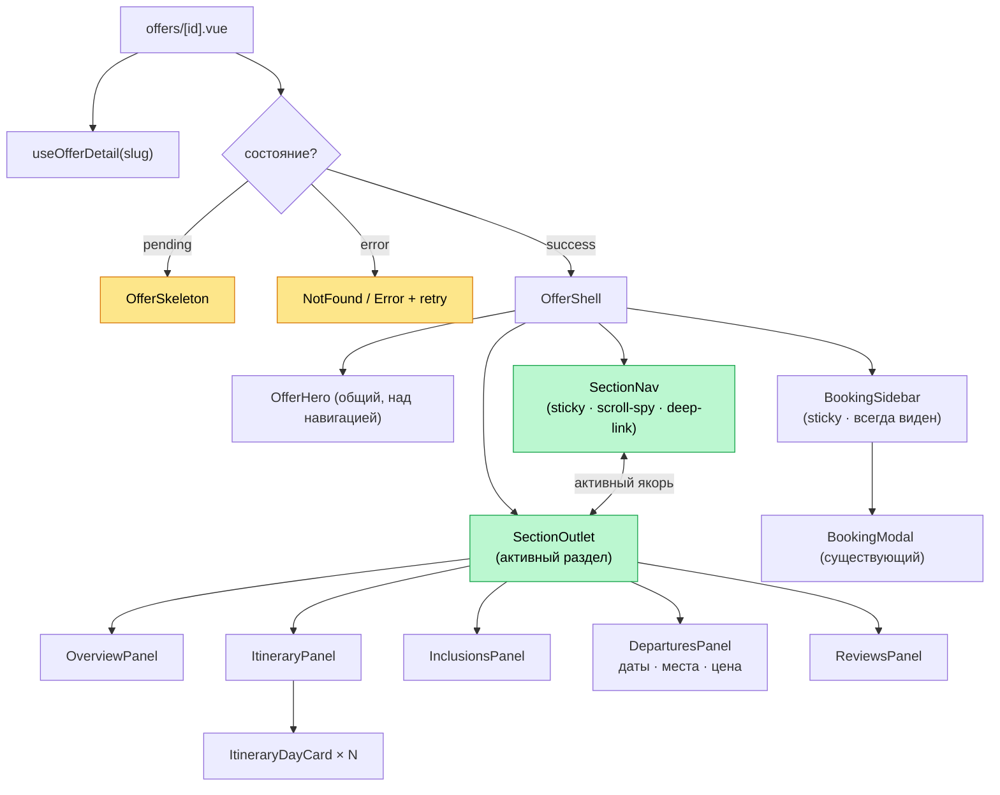
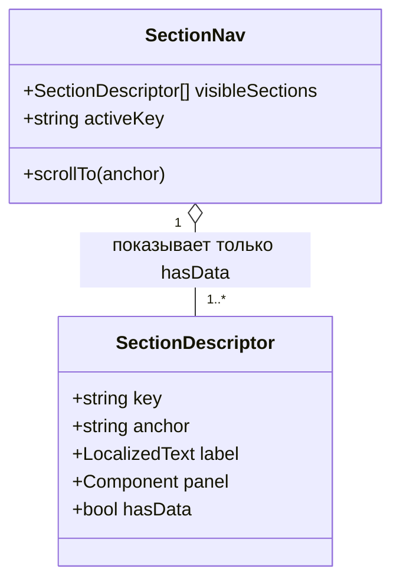
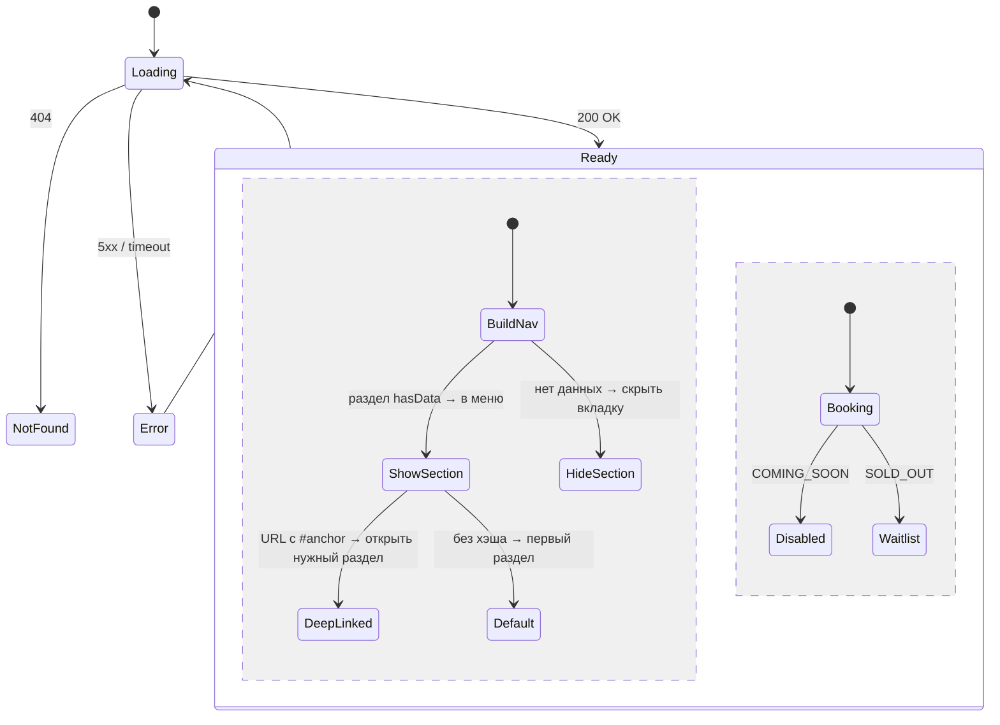

# Версия C — Вкладки / прогрессивное раскрытие

> Лучший UX для длинного контента. Навигация по разделам + постоянная панель брони.
> 📐 Редактируемый исходник: **`version-c-tabbed.drawio`** (страницы «Компоненты», «Модель навигации», «Состояния»).
> Домен-модель и обработка ошибок — см. [README](./README.md) / `domain-model.drawio`.

## Идея

Реальный тур — это **много контента** (7 дней программы, локации, что входит, даты, цена).
Один длинный скролл утомляет и прячет кнопку брони. Версия C разбивает контент на
именованные разделы с **навигацией** (табы или sticky scroll-spy меню):

`Обзор · Программа по дням · Что входит · Даты и цена · Отзывы`

Пользователь прыгает к нужному разделу, ссылка на раздел работает (`/offers/x#itinerary`),
а **панель брони закреплена** и видна всегда. Контент секций — те же компоненты, что в A;
добавляется слой **оркестрации навигации**.

## Архитектура компонентов



**Модель навигации** — секции строятся динамически: в меню попадают только те разделы,
для которых есть данные (нет программы → нет вкладки «Программа»).



**Структура файлов**

```
app/
  pages/offers/[id].vue
  components/offer/
    OfferShell.vue               # hero + nav + outlet + sidebar
    SectionNav.vue               # sticky навигация + scroll-spy
    panels/
      OverviewPanel.vue · ItineraryPanel.vue · InclusionsPanel.vue
      DeparturesPanel.vue · ReviewsPanel.vue
    ItineraryDayCard.vue
    BookingSidebar.vue
  composables/
    useOfferDetail.ts
    useSectionNav.ts             # активный раздел, scroll-spy, синхрон с URL-хэшем
```

## Состояния и edge-кейсы



**Особые случаи навигации:** если раздела нет — вкладка не показывается; если в URL
хэш на скрытый/несуществующий раздел — мягкий fallback на первый доступный.

## Плюсы и минусы

**Плюсы**
- Лучший UX для объёмного тура: контент не пугает длиной, бронь всегда под рукой.
- Deep-link на раздел (`#itinerary`) — удобно делиться и вести рекламу на конкретный блок.
- Меню само подстраивается под наполнение тура.

**Минусы**
- Сложнее A: scroll-spy, синхронизация с URL, состояние активной вкладки.
- На мобильном навигацию надо продумать (горизонтальный скролл табов / аккордеон).
- Табы могут «прятать» контент, снижая мотивацию читать всё (спорно для продаж).

## Готовность к CMS

CMS отдаёт ту же полную модель `Offer`; слой навигации строит разделы из наличия данных.
Панели — это секции из Версии A с добавленным якорем. Можно объединить с Версией B:
блоки группируются в разделы-вкладки. Хорошо работает, когда туры длинные и однотипные
по структуре, а приоритет — **usability и конверсия**.
